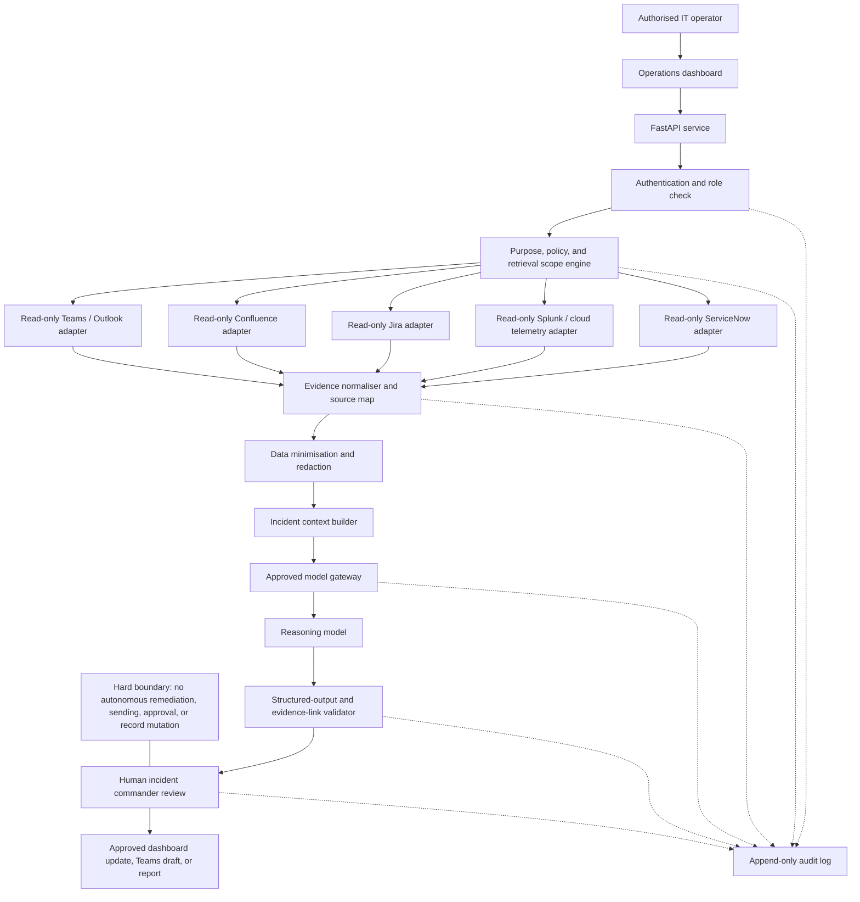
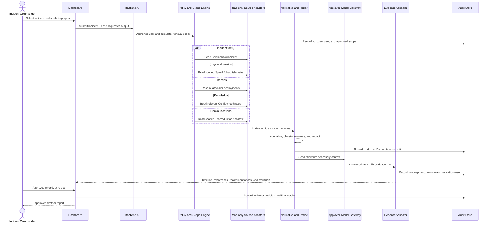

# OpsPilot AI - Recommended Documentation, Architecture, and Requirements Updates

## 1. Purpose and basis

This document recommends updates for the OpsPilot AI Sev-1 Incident Commander Assistant. It is derived primarily from the [EU regulatory research](./researched_requirements.md) and the current [architecture](./architecture.md) and [data flow](./data-flow.md).

The target use case is an internal, read-only evidence assistant for EU financial services. It retrieves incident evidence, creates evidence-linked drafts, and leaves every operational or communication decision to an authorised human.

The prototype must not be described as production-compliant. GDPR, DORA, AI Act classification, national employment rules, transfer safeguards, NIS2 displacement, CER designation, and PSD2 applicability require review by the organisation's legal, privacy, security, and operational-resilience teams.

## 2. Regulatory assumptions to document

Add these assumptions to the project overview and keep them under change control:

- **GDPR:** assumed applicable because incidents, logs, tickets, chats, and email can contain personal data. The system needs a documented lawful basis, purpose limitation, minimisation, retention, security, transparency, transfer controls, and accountability.
- **DORA:** treated as the main ICT operational-resilience regime for covered EU financial entities. The assistant and its model/cloud dependencies must enter ICT risk, incident, change, resilience, and third-party governance.
- **NIS2:** treated as conditional because DORA generally displaces equivalent NIS2 cyber risk-management and incident-reporting duties for covered financial entities.
- **AI Act:** the assistant is assumed to be in scope but not automatically high-risk. AI literacy applies. Any expansion into worker evaluation, credit decisions, customer eligibility, or a safety component requires legal reclassification.
- **CER:** applies only if the institution is designated as a critical entity under national law.
- **PSD2:** remains relevant when the operator is a payment service provider or when incidents may affect payment users.

The approved purpose must remain: `incident evidence retrieval, synthesis, and preparation of drafts for human review`.

## 3. Documentation updates

### 3.1 Project overview

Update `README.md` to include:

- Product purpose, users, supported scenarios, and explicit non-goals.
- Current implementation status versus target architecture.
- Local setup and demo instructions.
- Data classification warning: mock data only; no real employee or customer data.
- Human-approval boundary and prohibition on autonomous remediation.
- Links to architecture, data flow, requirements, regulatory research, and test evidence.

### 3.2 Architecture documentation

Update the architecture document to define:

- Trust boundaries between browser, backend, enterprise sources, model provider, and audit store.
- Authentication, role-based access, least-privilege connector scopes, and secret storage.
- An incident-scoped policy engine before retrieval.
- A canonical evidence schema with source ID, timestamp, system, classification, and immutable reference.
- Data minimisation and redaction before any model request.
- An approved model gateway enforcing region, model version, retention policy, and provider allow-list.
- Structured outputs whose material claims reference evidence IDs.
- Human review before posting, ticket mutation, report submission, or remediation.
- Append-only audit records for retrieval, model generation, review, and release.
- Timeouts, partial-source handling, retries, health checks, and degraded-mode behaviour.

### 3.3 Governance documentation

Create or maintain the following controlled records before production use:

- Data Protection Impact Assessment and record of processing activity.
- AI system card with intended purpose, prohibited uses, model/prompt versions, limitations, and owner.
- DORA ICT asset/service inventory entry and third-party provider register entries.
- Data-flow and international-transfer map, including model telemetry and subprocessors.
- Retention schedule for raw evidence, prompts, outputs, reports, and audit events.
- Human approval policy and role matrix.
- Model/provider change-control and use-case reclassification procedure.
- Incident reporting playbook separating GDPR, DORA, NIS2, AI Act, and PSD2 reporting lanes.
- AI literacy and automation-bias training record for operators and reviewers.

### 3.4 Required audit record

Each analysis session should record:

- Incident ID, requesting user, reviewer, purpose, and lawful-basis code.
- Systems queried, retrieval filters, time window, and evidence IDs returned.
- Personal-data categories, redaction actions, and special-category-data handling.
- Model provider, region, model version, prompt version, and generation parameters.
- Generated output, evidence links, warnings, and unavailable sources.
- Reviewer decision, edits, approval time, and final released version.
- External-transfer safeguard reference and retention class.

## 4. Recommended target architecture

### Architecture decisions

1. **Scope before retrieval:** incident ID, service, configuration item, environment, and time window constrain every source query.
2. **Parallel read-only adapters:** source retrieval runs concurrently to support the 30-second target. Connector credentials cannot write.
3. **Canonical evidence:** adapters return the same evidence contract instead of passing source-specific payloads directly to the model.
4. **Privacy boundary:** redaction and minimisation occur before model access, not after generation.
5. **Model governance:** only approved regions, providers, and model versions are callable.
6. **Evidence-linked output:** unsupported claims fail validation or are clearly labelled as unverified hypotheses.
7. **Meaningful human control:** the reviewer can inspect evidence, edit, reject, override, or suspend use.
8. **Audit independence:** audit events are append-only and stored separately from editable incident drafts.

## 5. Recommended data flow

### Failure and exception flow

- A failed source must not fail the whole investigation when useful evidence remains.
- The dashboard must identify unavailable, timed-out, stale, or access-denied sources.
- The model must not infer missing evidence as fact.
- Special-category or unrelated personal data must be quarantined or removed.
- No output may leave the dashboard without explicit authorised approval.
- Reporting deadlines may trigger reminders and draft templates only; submission remains human-controlled.

## 6. Recommended business requirements

| ID | Requirement | Acceptance measure |
|---|---|---|
| BR-01 | Reduce time spent gathering evidence during Sev-1 investigations. | Baseline manual collection time is recorded; the pilot demonstrates a measurable reduction on the same scenarios. |
| BR-02 | Provide one incident view across approved operational sources. | The dashboard displays source status and retrieved evidence from ServiceNow, Splunk/cloud telemetry, Jira, Confluence, and Teams/Outlook. |
| BR-03 | Make outputs explainable and defensible. | Every material factual claim, hypothesis, and recommendation links to one or more evidence IDs or is marked unsupported. |
| BR-04 | Preserve human accountability. | Only authorised reviewers can approve a draft; the system cannot remediate, send messages, submit reports, or mutate enterprise records. |
| BR-05 | Support regulated incident governance. | The system preserves chronology, evidence, model provenance, reviewer decisions, and exportable audit records. |
| BR-06 | Protect personal and confidential information. | Retrieval is incident-scoped; unnecessary personal data is removed before model access; retention and transfer rules are enforced. |
| BR-07 | Support timely reporting without automating regulatory decisions. | DORA/GDPR/NIS2/AI Act/PSD2 templates and deadline reminders remain distinct and are labelled as drafts for review. |
| BR-08 | Control use-case and model changes. | New purposes, connectors, providers, regions, or material model versions require documented security, privacy, legal, and product approval. |
| BR-09 | Continue operating when one source is unavailable. | Available evidence is returned with a prominent partial-result warning and source-specific failure reason. |
| BR-10 | Support the three agreed demonstrations. | Incident Investigation, Morning Operations Briefing, and CAB Review each have defined inputs, expected outputs, and acceptance evidence. |

## 7. Recommended non-functional requirements

| ID | Area | Requirement and measurable acceptance criterion |
|---|---|---|
| NFR-01 | Performance | Incident analysis completes within 30 seconds at p95 under the agreed pilot load. Source retrieval runs concurrently and each connector has an explicit timeout. |
| NFR-02 | Availability | Production target is 99.9% monthly availability for the backend and dashboard, excluding approved maintenance. The prototype must not claim this until monitoring data exists. |
| NFR-03 | Degraded mode | A single source timeout returns a partial result within the response target and identifies the missing source. |
| NFR-04 | Access control | All users authenticate through the approved identity provider. Roles separate operator, reviewer, administrator, and auditor access. |
| NFR-05 | Read-only enforcement | Connector identities have read-only permissions. Integration tests verify that write, send, approve, close, deploy, and remediation operations are unavailable. |
| NFR-06 | Data minimisation | Queries are restricted by incident ID, service/CI, environment, and time window. Fields not needed for analysis are excluded or redacted before model access. |
| NFR-07 | Data residency and transfer | Model calls use approved regions and providers. Cross-border transfers, subprocessors, telemetry, and support access have documented safeguards before use. |
| NFR-08 | Retention | Raw evidence, prompts, outputs, and audit records use approved retention classes with automated deletion or legal-hold handling. Retention periods must be supplied by records management. |
| NFR-09 | Auditability | 100% of sessions record requester, purpose, scope, evidence IDs, transformations, model/prompt versions, output, reviewer, and final decision in an append-only store. |
| NFR-10 | Provenance | 100% of material claims and recommendations include valid source references. Broken or inaccessible references fail validation. |
| NFR-11 | Human oversight | Outputs are visibly marked `Draft - Human Review Required` until approval. Reviewers can inspect evidence, edit, reject, override, and suspend use. |
| NFR-12 | AI reliability | Responses conform to a versioned schema. Unknowns and conflicts are explicit; confidence is never presented without supporting evidence. |
| NFR-13 | Model governance | Every request records approved provider, region, model version, and prompt version. Unapproved endpoints and versions are blocked. |
| NFR-14 | Security | Data is encrypted in transit and at rest; secrets use an approved vault; environments are separated; logs do not expose secrets or unredacted personal data. |
| NFR-15 | Observability | Metrics cover latency by stage, connector failures, model failures, redaction counts, validation failures, approvals, rejections, and audit-write failures. Alerts have named owners. |
| NFR-16 | Resilience | Recovery objectives, backup policy, restoration test, provider outage procedure, and manual fallback are documented and tested before production. |
| NFR-17 | Compliance evidence | DPIA, processing record, DORA inventory/register entries, transfer assessment, AI classification, training records, and control test results have owners and review dates. |
| NFR-18 | Scope control | The platform blocks unapproved employment monitoring, customer eligibility, credit decisions, and safety-component use. Material scope changes trigger legal reclassification. |
| NFR-19 | Usability | An incident commander can identify severity, impact, evidence, unavailable sources, timeline, hypotheses, recommendations, and approval state without opening another view. |
| NFR-20 | Accessibility | Core dashboard workflows meet WCAG 2.2 AA and are usable with keyboard navigation and screen-reader labels. |

## 8. Reporting timelines to represent in documentation

The dashboard may track and draft against these lanes, but must not decide applicability or submit reports:

| Regime | Research-derived timing to display | Control |
|---|---|---|
| GDPR | Personal-data breach notification within 72 hours where required. | Separate privacy assessment and Data Protection Officer approval. |
| DORA | Initial notice as early as possible, within four hours of major classification and no later than 24 hours from awareness; intermediate within 72 hours after initial; final within one month after intermediate. | Major-incident classification and submission remain human decisions. |
| NIS2 | 24-hour early warning, 72-hour notification, and one-month final report where applicable. | Show only when DORA displacement and entity scope have been assessed. |
| AI Act | High-risk serious-incident reporting generally within 15 days, with faster cases possible. | Show only after AI classification and legal confirmation. |
| PSD2 | Competent-authority and affected-user notification without undue delay where applicable. | Payments compliance approves content and recipients. |

## 9. Priority delivery plan

### P0 - Required for a defensible demo

- Clearly label mock systems, synthetic data, draft AI outputs, and incomplete controls.
- Add the policy/scope, evidence normalisation, redaction, evidence-link, and approval stages to architecture and data-flow documentation.
- Define the structured incident response and audit event schemas.
- Demonstrate read-only access and a visible human-approval state.
- Show source references and unavailable-source warnings in the dashboard.
- Add current-versus-target implementation status to the README.

### P1 - Required before a controlled pilot

- Complete the DPIA, processing record, AI classification, transfer map, retention schedule, and DORA service/third-party inventory.
- Implement enterprise authentication, RBAC, secrets management, append-only audit storage, and approved model routing.
- Add partial-failure, timeout, validation, redaction, and approval tests.
- Define service levels, recovery objectives, manual fallback, and operational ownership.

### P2 - Required before production

- Complete resilience, restoration, security, privacy, model-quality, accessibility, and load testing.
- Obtain legal, privacy, security, architecture, operational-risk, and records-management approval.
- Establish recurring control testing, provider review, AI literacy training, model monitoring, and use-case reclassification reviews.

## 10. Definition of done for this documentation scope

This documentation work is complete when:

- Current state and target state are clearly separated.
- Architecture and data flow show every trust boundary and control stage.
- Business and non-functional requirements have owners, priorities, and testable acceptance criteria.
- Each regulatory assumption links to a control, document, or requirement.
- Human approval and read-only boundaries are explicit throughout.
- Regulatory applicability and timelines are marked for legal validation.
- The dashboard demonstration can trace each visible claim back to mock evidence.
