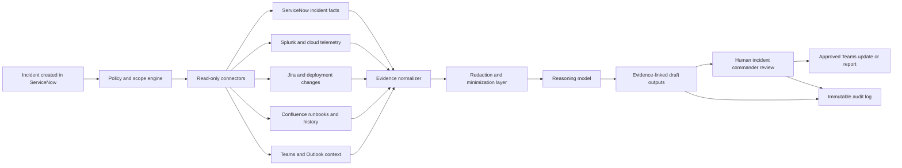

# EU Regulatory Guide for an AI Sev‑1 Incident-Response Agent in Financial Services

## Executive summary

For an AI agent that reads ServiceNow incidents, pulls Splunk or cloud telemetry, reviews Jira and Confluence history, reads Teams or Outlook context, and then generates summaries, root-cause hypotheses, recommended actions, and management updates, the core EU regimes are **GDPR** for personal-data handling, **DORA** for financial-sector ICT resilience, **NIS2** only where DORA does not displace it, the **AI Act** depending on the system’s role and risk classification, and **CER** only if the entity is designated as a critical entity under national law. For banks, payment institutions, investment firms, and many other regulated financial entities, **DORA is the main operational-resilience rulebook** and is expressly treated under NIS2 as the sector-specific regime that replaces NIS2 cybersecurity risk-management and incident-reporting obligations for covered financial entities. citeturn17view0turn15view1turn32search4

The strongest immediate legal exposure for your design is usually **GDPR**, because Sev‑1 evidence almost always contains personal data: names, email addresses, usernames, phone numbers, IPs, device identifiers, meeting/chat content, escalation chains, and sometimes HR or health hints embedded in tickets or messages. That means the agent must have a lawful basis, strict purpose limitation, data minimization, security of processing, transfer controls, and clear accountability records. If the tool ingests employee communications, additional employment-context rules may apply at Member State level. citeturn11view0turn11view1turn11view3turn11view4turn11view5turn35view1

For the **AI Act**, the key practical point is that an internal Sev‑1 copilot is **not automatically a high-risk AI system** just because it is used by a bank. High-risk status depends on the Act’s use-case categories and intended purpose. Internal incident triage, summarization, and evidence synthesis are not listed as standalone Annex III use cases. The system could move toward high-risk only if it becomes a **safety component in the management and operation of critical digital infrastructure** or is repurposed for listed use cases such as employment decisions or creditworthiness. Even if not high-risk, the AI Act already imposes **AI literacy** duties, and if any high-risk classification applies later, then logging, transparency, human oversight, and incident reporting duties become much heavier. citeturn21view0turn22view0turn22view2turn22view5turn36view1turn37search5

The legally safest architecture for this agent is a **retrieval-and-synthesis support system with no autonomous remediation**: read-only connectors, scoped retrieval, redaction or pseudonymization before model calls where feasible, source-linked outputs, immutable audit logs, strict human approval, and model/provider governance comparable to other ICT outsourcing and operational-risk controls. In EU banking, this design aligns well with GDPR accountability, DORA ICT risk management and incident recording, and the AI Act’s emphasis on transparency and human oversight where applicable. citeturn11view3turn11view4turn11view5turn17view2turn17view3turn18view4turn24view0turn24view2

## Legal perimeter and what likely applies

### GDPR applies almost by default

GDPR applies whenever the agent processes personal data, and the definitions are broad. “Personal data” and “processing” include retrieval, consultation, use, disclosure, storage, and combination of information relating to identifiable natural persons. A Sev‑1 workflow that reads incidents, logs, chats, email threads, ticket comments, and historical reports is squarely within that scope. GDPR therefore governs the agent regardless of whether the system is rule-based, AI-assisted, or LLM-based. citeturn33view2turn39view2

For this use case, the most plausible lawful bases are usually **legal obligation** and/or **legitimate interests**, not employee consent. Consent is weak in organisational operations because GDPR requires it to be freely given, and the Regulation expressly warns that consent is not a valid ground where there is a clear imbalance between data subject and controller. In practice, banks typically rely on legal-obligation processing for mandatory security, incident, and audit workflows, and on carefully documented legitimate interests for ancillary diagnostic and resilience functions that are necessary and proportionate. citeturn11view1turn29view0turn28search11

### DORA is the main financial-sector regime

DORA applies to a broad set of financial entities, including credit institutions and payment institutions. It requires an ICT risk-management framework, incident management and reporting, and third-party ICT risk controls. For a bank-operated Sev‑1 AI agent, DORA matters both because the agent may become part of the bank’s own ICT environment and because the model provider, cloud host, or orchestration layer may be an ICT third-party service dependency. citeturn17view0turn17view2turn17view3turn18view4

### NIS2 is still relevant, but often displaced for banks

NIS2 covers banking and financial market infrastructures in principle, but it also says that where sector-specific Union acts impose at least equivalent cybersecurity risk-management and incident-reporting requirements, those sector-specific rules apply instead. NIS2 expressly identifies DORA as that sector-specific act for financial entities. So, for a bank, DORA usually displaces NIS2’s Articles 21 and 23 duties on cybersecurity measures and incident reporting, although NIS2 still matters for ecosystem context, third parties, and coordination with national cyber authorities. citeturn13view2turn15view1

### CER applies only if the institution is designated as a critical entity

The CER Directive is not a universal finance rule. It applies where a Member State identifies the institution as a **critical entity** providing essential services. If that happens, the firm must perform risk assessments, adopt resilience measures, and notify relevant incidents without undue delay. Because CER is a directive, the details of designation, procedure, and sanctions vary by Member State. citeturn30view0turn30view1turn30view2turn7search3

### The AI Act applies, but high-risk status is the key threshold

The AI Act entered into force on 1 August 2024. Prohibited practices and AI literacy obligations have applied since 2 February 2025, and governance and GPAI obligations since 2 August 2025. The Commission’s July 2026 implementation page states that the broader framework would otherwise apply from 2 August 2026, while also noting a 2026 political agreement on simplification that would defer certain high-risk timelines, especially for some Annex III and product-integrated systems. As of 11 July 2026, the safest reading is that **AI literacy already applies**, and firms should monitor the final position on the later high-risk provisions very closely. citeturn36view1turn37search5

For your agent specifically, the best current legal assumption is: **AI Act applies as an AI system in scope, but not necessarily as high-risk**. An internal Sev‑1 copilot that summarizes evidence and proposes hypotheses is not itself listed in Annex III. It becomes much riskier under the AI Act if it is used as a safety component for critical digital infrastructure, or if the same system is reused for employment monitoring or making decisions that affect creditworthiness or other essential private services. citeturn22view0turn22view2turn22view5

## Key obligations by regime

### GDPR obligations for this agent

GDPR Article 5 is the backbone: **purpose limitation, data minimization, accuracy, storage limitation, integrity/confidentiality, and accountability**. For this agent, that means the system should pull only incident-relevant slices of email, chat, logs, and tickets; should not ingest enterprise-wide corpora “just in case”; should separate raw evidence from derived summaries; and should retain only what is necessary for incident response, audit, or legal defense. citeturn11view0turn39view2

Privacy-by-design is not optional. Article 25 requires data protection by design and by default, while Article 32 requires security of processing. In this context, the practical controls are clear: read-only connectors, least-privilege scopes, environment segregation, secret management, field-level masking, redaction of low-value personal data before model calls, and strict restrictions on who can view prompts, outputs, and source evidence. citeturn11view3turn11view5

You should assume a **DPIA is likely prudent and often necessary**. Article 35 requires a data protection impact assessment where processing is likely to result in a high risk to individuals. An AI system that combines multiple enterprise systems, reads employee communications, analyzes logs, and generates operational inferences is exactly the kind of integrated processing that should be assessed formally before production deployment. If the DPIA shows residual high risk that cannot be mitigated, prior consultation with the supervisory authority may be required. citeturn11view7

Transparency duties also matter. If the agent uses personal data collected from employees or other natural persons, Articles 13 and 14 require the controller to explain the purposes, legal basis, recipients, retention, and relevant rights. In employment contexts, Article 88 allows Member States to adopt more specific rules, so internal notices and worker-related governance must be checked against national law. The reportable implication is simple: do not deploy the agent as a hidden workplace surveillance layer. citeturn33view3turn33view4turn35view1

Cross-border transfers are a major deployment risk. If prompts, retrieved snippets, or model telemetry are sent outside the EEA, Articles 44 to 46 require a valid transfer mechanism, such as an adequacy decision or appropriate safeguards. For a Sev‑1 agent, this means model routing, logging infrastructure, support access, and vendor subprocessors all have to be mapped before go-live. citeturn11view8turn33view0turn33view1

The “fully automated decisions” issue is narrower than many teams assume, but still important. GDPR Article 22 gives individuals the right not to be subject to a decision based solely on automated processing that produces legal or similarly significant effects. An internal system recommendation about technical remediation is often **not** such a decision. But if the tool starts deciding what to disclose to customers, whether to suspend employee access, or how individuals are assessed, then Article 22 risk rises sharply. Your stated human-approval requirement is therefore a strong legal control, not just a governance preference. citeturn11view2turn29view1

If special-category data appears in tickets or messages, Article 9 becomes relevant. In practice, incident records sometimes contain health details, union references, or other sensitive information. The safe design is to detect and quarantine such content unless there is a clear legal basis and need to process it. citeturn35view2

Enforcement is severe. GDPR fines can reach up to **€20 million or 4% of worldwide annual turnover**, depending on the breach, and failures on core principles, data subject rights, or transfers fall into the higher tier. citeturn12view0turn12view1

### DORA and financial-sector supervisory expectations

DORA requires a documented ICT risk-management framework that protects information and ICT assets, uses strategies, policies, procedures, protocols, and tools, and is reviewed at least annually and after major ICT incidents. For your agent, that means the AI workflow cannot sit outside normal bank change control, architecture review, internal audit, resilience testing, and operational-risk governance. If it is part of the incident-response process, it is part of the bank’s ICT control environment. citeturn17view2

DORA also requires an ICT-related incident management process that detects, manages, classifies, logs, and notifies incidents, with root causes identified, documented, and addressed. This requirement maps directly onto your product concept. A compliant version of the agent should therefore not produce unsupported answers; it should produce **evidence-linked summaries**, preserve the source chain, and record what data was used and what human decisions followed. citeturn17view3

For major ICT-related incidents, DORA reporting is time-sensitive. Under the delegated reporting RTS, the **initial notification** is due as early as possible and in any case **within four hours from classification as major and no later than 24 hours from awareness**; the **intermediate report** is due **within 72 hours after the initial notification**; and the **final report** is due **within one month after the intermediate report**. If your agent supports regulated reporting, it should clearly separate “draft for human review” from “regulatory submission,” and retain the evidence that supports each draft field. citeturn20view0

DORA’s third-party risk rules are crucial for AI. Financial entities must maintain a register of information on contractual arrangements for ICT services provided by ICT third parties. They also must assess concentration risk and structure contracts so they can monitor outsourced services and support supervision. In practical terms, if your agent relies on a foundation model API, cloud inference service, vector database vendor, or orchestration platform, the bank must treat those dependencies as part of ICT third-party governance, not as an informal experimentation stack. citeturn18view4turn18view5turn18view6

Penalties under DORA are set by Member States, but the Regulation requires them to be effective, proportionate, and dissuasive, and gives competent authorities powers to investigate, require remediation, and publish sanctions. So the exact fine matrix varies nationally, but enforcement risk is real. citeturn19view0turn19view1turn19view2

Supervisory material reinforces the same direction of travel. The EBA’s ICT and security risk management guidelines target credit institutions, investment firms, and payment service providers, while its outsourcing guidelines define how firms assess whether outsourced functions are critical or important. ESMA’s DORA materials emphasize incident management, notification of major incidents, resilience testing, and information-sharing. ECB materials on cyber resilience focus on the ability of banks and financial infrastructures to protect systems and **resume operations quickly after an attack**, and the 2024 cyber resilience stress test specifically examined response and recovery capabilities rather than prevention alone. citeturn34view0turn34view1turn34view3turn34view5turn31search0turn31search9

PSD2 remains relevant where the institution is a payment service provider. PSD2 requires PSPs to establish a framework with mitigation and control mechanisms for operational and security risks, maintain effective incident-management procedures, and notify major operational or security incidents without undue delay, while informing affected payment users where their financial interests may be impacted. In 2026, DORA is the main financial resilience regime, but PSD2 still matters for payments-specific context and customer-facing consequences. citeturn38view0turn38view1turn38view2turn38view3

### NIS2 and CER obligations where relevant

If the operator is not covered by DORA, or if you are building the same agent for a non-financial essential or important entity, NIS2 requires cybersecurity risk-management measures and formal incident reporting. Article 21 expects proportionate measures covering prevention, detection, response, recovery, supplier and service-provider security, and access control. ENISA’s NIS2 technical guidance is expressly designed to help entities implement these controls with practical evidence mappings. citeturn13view3turn34view4

NIS2 incident reporting works on a **24h / 72h / one‑month** structure: early warning within 24 hours, incident notification within 72 hours, and a final report within one month after the notification. For a reporting-support AI agent, this means the workflow should be able to preserve a chronology of what was known at the early-warning stage, what changed by the 72-hour report, and what final root-cause and mitigation conclusions were added later. citeturn14view1turn14view2turn13view6

NIS2 enforcement is also significant: Member States must make available maximum fines of at least **€10 million or 2% global turnover** for essential entities and at least **€7 million or 1.4%** for important entities when Articles 21 or 23 are breached. Because NIS2 is a directive, exact procedures, competent authorities, and sanctions mechanisms vary nationally. citeturn16view0turn16view2turn7search3

CER is broader than cyber. If a bank or FMI is designated a critical entity under national law, CER requires risk assessments, proportionate technical, security, and organisational resilience measures, and incident notification without undue delay. CER is especially relevant if the Sev‑1 agent becomes embedded in a wider all-hazards operational-resilience program rather than a purely cyber workflow. citeturn30view0turn30view1turn30view3turn30view5

### AI Act obligations and why classification matters

The AI Act already imposes **AI literacy** obligations on providers and deployers. The Commission’s Q&A says Article 4 requires providers and deployers to ensure a sufficient level of AI literacy among staff and others dealing with the system, taking into account the context of use, the system’s risks, and the knowledge of the people operating it. For your product, that means incident commanders, SREs, security analysts, compliance reviewers, and model owners should all receive role-specific guidance, not just a generic “read the docs” instruction. citeturn21view0turn37search5

If the system is or becomes **high-risk**, the obligations tighten materially. High-risk systems must allow logging, have sufficient transparency for deployers to interpret outputs properly, support effective human oversight, and be robust and cybersecure. Deployers must use the system according to instructions, ensure input data is relevant and sufficiently representative where they control it, monitor operation, keep logs under their control for at least six months, and suspend use if they believe the system presents a risk. Those duties map neatly to an enterprise AI control framework for incident response. citeturn24view4turn24view0turn24view2turn25view1turn25view2turn26view2turn26view3

The practical classification point is this: an internal incident-response agent normally looks more like a **general operational support tool** than an Annex III high-risk system. But the line can move. If the same system is integrated as a safety component in critical digital infrastructure, or if it is reused to monitor or evaluate workers, or to make credit-related determinations for natural persons, then high-risk classification becomes much more plausible. Scope drift is therefore one of the biggest compliance risks. citeturn22view0turn22view2turn22view5

If a high-risk system causes a serious incident, the AI Act imposes reporting duties: generally no later than **15 days** after awareness, with faster reporting for widespread infringements and certain severe outcomes. That is a very different reporting lane from cyber-incident reporting and should be kept in a separate compliance playbook. citeturn27view0turn27view1

AI Act penalties are potentially very high: up to **€35 million or 7%** of global annual turnover for prohibited practices, up to **€15 million or 3%** for many operator obligations including deployer obligations in Article 26 and transparency obligations in Article 50, and up to **€7.5 million or 1%** for supplying incorrect or misleading information. citeturn23view0turn23view1turn23view2turn23view4

## Comparison of the main obligations

| Regime | When it applies to this agent | Most relevant duties | Key timelines | Enforcement |
|---|---|---|---|---|
| **GDPR** | Almost always, if incidents/logs/chats/emails contain personal data. citeturn33view2 | Lawful basis; purpose limitation; minimization; privacy by design; records of processing; security; transparency; transfer controls; limits on solely automated decisions about people. citeturn11view0turn11view1turn11view3turn11view4turn11view5turn11view8turn29view1 | Personal-data breach notification to supervisory authority within 72 hours where feasible. citeturn11view6 | Up to €20m or 4% global turnover for higher-tier infringements. citeturn12view1 |
| **DORA** | Core regime for banks and many other EU financial entities. citeturn17view0 | ICT risk-management framework; incident management and recording; root-cause documentation; major incident reporting; ICT third-party governance; concentration-risk assessment; contractual controls. citeturn17view2turn17view3turn18view4turn18view5turn18view6 | Initial major-incident notice within 4 hours of major classification and no later than 24 hours from awareness; intermediate within 72 hours after initial; final within one month after intermediate. citeturn20view0 | National penalties/remedies must be effective, proportionate, and dissuasive; supervisory authorities may investigate and require remediation. citeturn19view0turn19view1 |
| **NIS2** | Relevant mainly where DORA does not displace it, or for non-financial essential/important entities. For financial entities, DORA is lex specialis for cyber risk-management and incident reporting. citeturn15view1 | Proportionate cyber risk-management measures, supplier security, access controls, incident reporting. citeturn13view3turn14view1 | 24h early warning, 72h notification, one-month final report. citeturn14view1turn13view6 | At least €10m/2% for essential entities and €7m/1.4% for important entities for certain breaches. citeturn16view0turn16view2 |
| **AI Act** | Applies to AI systems in scope; heavy obligations depend on high-risk classification. AI literacy already applies. citeturn36view1turn37search5 | AI literacy now; if high-risk, logging, transparency, human oversight, monitoring, input-data relevance, incident handling, and in some cases public database registration. citeturn24view4turn24view0turn24view2turn25view1turn26view2turn37search3 | For high-risk serious incidents: generally 15 days, faster in some severe cases. citeturn27view0turn27view1 | Up to €35m/7% for prohibited practices; up to €15m/3% for many operator obligations; up to €7.5m/1% for misleading information. citeturn23view0turn23view2turn23view4 |
| **PSD2 and EBA security guidance** | Relevant where the firm is a payment service provider or payment institution. citeturn38view0turn34view2 | Operational/security risk framework; incident management; reporting of major operational/security incidents; customer communications if users’ financial interests are affected. citeturn38view0turn38view1 | Notify competent authority without undue delay; notify payment users without undue delay where relevant. citeturn38view1turn38view3 | National supervisory enforcement under PSD2 architecture; DORA now overlays the broader ICT-resilience framework. citeturn38view0turn32search4 |
| **CER** | Only if identified nationally as a critical entity. Member-state rules may vary. citeturn30view0turn7search3 | Critical-entity risk assessment; proportionate technical/security/organisational resilience measures; incident notification. citeturn30view0turn30view1turn30view2 | Risk assessment within nine months of notification as a critical entity, then at least every four years; incident notification without undue delay. citeturn30view0turn30view3 | National implementation and sanctions vary by Member State. citeturn7search3 |

## Practical control architecture for a compliant design

A defensible architecture is a **read-only evidence assistant**, not a remediation bot. In legal terms, that architecture best supports GDPR minimization and accountability, DORA incident recording and third-party governance, and AI Act logging and human oversight if the system ever crosses into high-risk use. citeturn11view0turn11view3turn11view4turn17view3turn18view4turn24view4turn24view2

The concrete controls that best fit the EU framework are these. First, use **connector scoping**: incident ID, affected CI, timeframe, impacted service, and known deployment window should constrain every retrieval call. Second, keep connectors **read-only** and deny the model direct access to mutate tickets, post to Teams, or send Outlook messages. Third, maintain a **source map** so every summary sentence, hypothesis, or suggested action references the underlying incident text, log fragment, deployment record, or historical incident. This directly supports accountability and helps avoid unsupported AI-generated claims. citeturn11view0turn17view3turn24view0

Fourth, put a **redaction and data-minimization layer** between enterprise systems and the model. Remove or mask personal email addresses, phone numbers, chat signatures, calendar metadata, and unrelated mailbox content where they do not materially help incident diagnosis. Fifth, route model calls through a **vendor governance gate** that enforces allowed regions, approved model versions, contractual checks, and cross-border transfer restrictions. Sixth, preserve **immutable audit trails** showing who invoked the tool, what systems were queried, what evidence was returned, which model/version generated which draft, and which human approved the output. citeturn11view8turn17view2turn18view4turn39view0

A bank should also treat the model supply chain as part of **ICT third-party risk management**. Maintain a service register entry for each model or cloud provider, record subprocessor dependencies, identify whether the provider supports a critical or important function, and assess concentration risk if the same provider also hosts other critical bank workloads. That is not “extra AI governance”; it is normal DORA-grade outsourcing discipline applied to AI. citeturn18view4turn18view5turn34view1

## Main compliance gaps and the checklist to close them

The biggest real-world gap is **scope creep**. Teams often start with a “summarization assistant” and later let it rank responders, recommend customer communications, force ticket routing, or suppress alerts. That can change the legal profile of the system materially, especially under GDPR Article 22 and the AI Act’s high-risk categories around employment, credit, and critical infrastructure. Put a formal change-control gate on use-case expansion. citeturn29view1turn22view2turn22view5

The second major gap is **silent transfer risk**. Even when the bank believes data stays “in Europe,” prompts, traces, support telemetry, abuse monitoring, or subprocessor logs may leave the EEA. Map all vendor data flows, keep a written transfer assessment, and block unapproved model endpoints at the platform level. citeturn11view8turn33view0turn33view1

The third gap is **poor evidence provenance**. If the agent produces a root-cause hypothesis without preserving which evidence fragments supported it, the output becomes difficult to audit under GDPR accountability, difficult to defend under DORA incident documentation, and difficult to supervise under any later AI Act obligations. Treat evidence linkage as a mandatory product requirement, not a nice-to-have. citeturn11view4turn17view3turn24view0

The fourth gap is **insufficient human review**. It is not enough to show a human the draft if the human routinely rubber-stamps it. Meaningful review requires that an authorised person can inspect the evidence, understand the system’s limits, override the proposal, and stop its use when needed. EU law uses different language across regimes, but this is the common operational expectation. citeturn24view2turn25view5turn26view2turn26view3

A concise implementation checklist for this product is:

- Complete a **records-of-processing entry** and a **DPIA**, and map the lawful basis for each connector and output type. citeturn11view4turn11view7turn11view1  
- Classify the agent under your **DORA ICT inventory** and third-party register, including model vendors and cloud inference providers. citeturn17view2turn18view4  
- Enforce **read-only, least-privilege connectors** and issue-scoped retrieval. citeturn11view3turn13view3  
- Add **redaction/pseudonymization** before model access wherever feasible. citeturn11view5turn33view2  
- Require **source-linked outputs** for every summary, hypothesis, and recommendation. citeturn17view3turn24view0  
- Separate **drafting** from **sending or ticket mutation**; no automatic remediation and no unsupervised outbound communications. citeturn29view1turn24view2  
- Preserve **immutable logs** of queries, evidence, model version, output, reviewer, and final decision. citeturn17view3turn24view4turn25view2  
- Train users for **AI literacy**, automation-bias awareness, and escalation duties. citeturn37search5turn24view2  
- Maintain a **regulatory playbook** that distinguishes GDPR breach reporting, DORA/NIS2 incident reporting, and any AI Act serious-incident reporting. citeturn11view6turn20view0turn14view1turn27view0  
- Add a **use-case expansion gate** so the same system cannot quietly drift into employment monitoring, customer eligibility, or safety-component use without reclassification and legal review. citeturn22view0turn22view2turn22view5  

## Suggested audit-log language and human-approval policy

For this product, the audit log should be written to show not only **what the model said**, but also **why the organisation was allowed to process the data and who remained accountable**. That style supports GDPR accountability, DORA incident recording, and AI Act-style logging if the system later falls into a higher-risk category. citeturn11view4turn17view3turn24view4

A good audit-log wording pattern is:

> **Incident AI Session Record**  
> Incident ID: `SEV1-2026-00124`  
> Requesting user: `Incident Commander`  
> Purpose of processing: `Operational incident triage and preparation of draft management update`  
> Lawful-basis code: `LEGAL_OBLIGATION_SECURITY` or `LEGITIMATE_INTEREST_INCIDENT_RESPONSE`  
> Sources queried: `ServiceNow incident`, `Splunk logs`, `Azure Monitor`, `Jira changes`, `Confluence runbooks`, `Teams incident channel`  
> Retrieval scope: `service=payments-api; time_window=2026-07-11 08:00–10:30 UTC; incident_id linked`  
> Personal-data minimization applied: `yes`  
> Redaction applied: `email addresses masked; phone numbers removed; unrelated mailbox content excluded`  
> Model/provider/version: `approved-model-x / provider-y / version-z`  
> Output type: `draft summary; root-cause hypotheses; recommended next actions; Teams-ready update`  
> Source references attached: `yes`  
> Human reviewer: `name/role`  
> Reviewer decision: `approved / amended / rejected`  
> External transfer outside EEA: `no / yes with safeguard reference`  
> Retention class: `incident-governance-log`  

That wording is not mandated verbatim by EU law, but it captures the fields that regulators and internal auditors usually need to see to verify lawful purpose, minimization, evidence provenance, model provenance, and human responsibility. citeturn11view0turn11view8turn17view3turn18view4

A strong human-approval policy for this tool would read as follows:

> **Human Approval Policy for Sev‑1 AI Assistant**  
> The AI assistant may retrieve incident-related data from approved read-only sources and generate draft summaries, hypotheses, action recommendations, and communication drafts. The assistant must not autonomously execute remediation, change system configurations, create or close records, send external or internal communications, notify customers, or make determinations affecting employees or other natural persons.  
> All outputs must be reviewed by an authorised human incident commander or delegate with access to the underlying evidence. The reviewer must be able to inspect sources, edit the draft, reject the output, override the recommendation, or suspend use of the assistant.  
> If the reviewer considers that the system output is unsupported, risky, or potentially non-compliant, the output must not be actioned until manually revalidated.  
> Any suspected model malfunction, unsafe output, unexplained recommendation, or unintended use outside the approved incident-response purpose must be escalated immediately to the product owner, security function, and relevant compliance contact.  

This policy is legally well aligned with GDPR’s limits on solely automated decisions about people and with the AI Act’s human-oversight logic for high-risk systems. It also fits DORA’s emphasis on documented incident handling, root-cause analysis, and governance responsibility. citeturn29view1turn24view2turn26view2turn17view3

In short, the most realistic EU compliance position for your product today is: **treat it as a GDPR-governed, DORA-controlled, human-supervised evidence assistant; assume AI Act literacy obligations now; monitor carefully for any change that could make it high-risk; and avoid turning it into an autonomous actor.** That is the architecture most consistent with how EU law currently distinguishes useful AI support from unacceptable opaque automation in operationally critical environments. citeturn11view0turn17view2turn36view1turn37search5